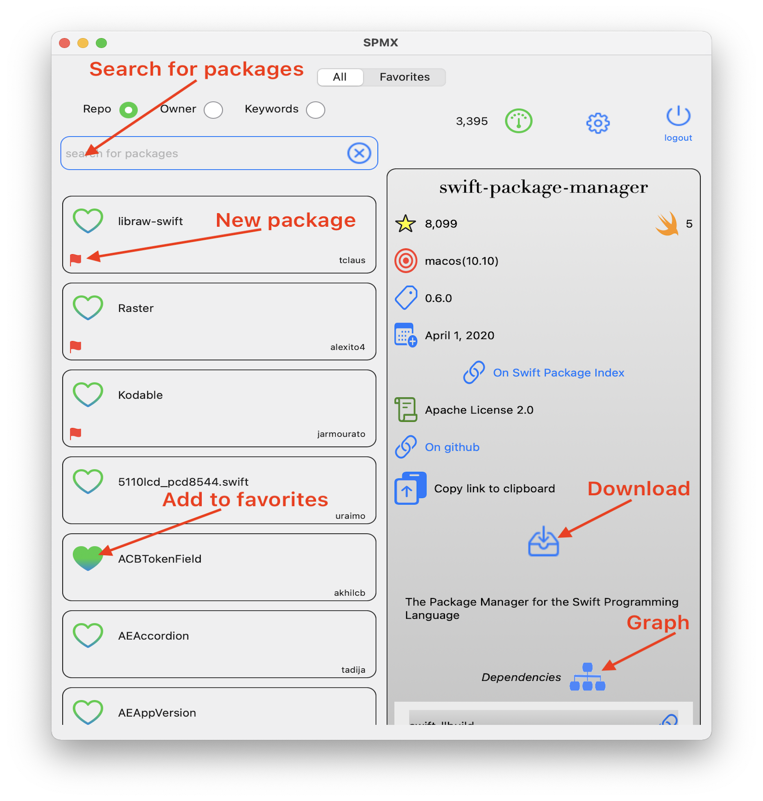
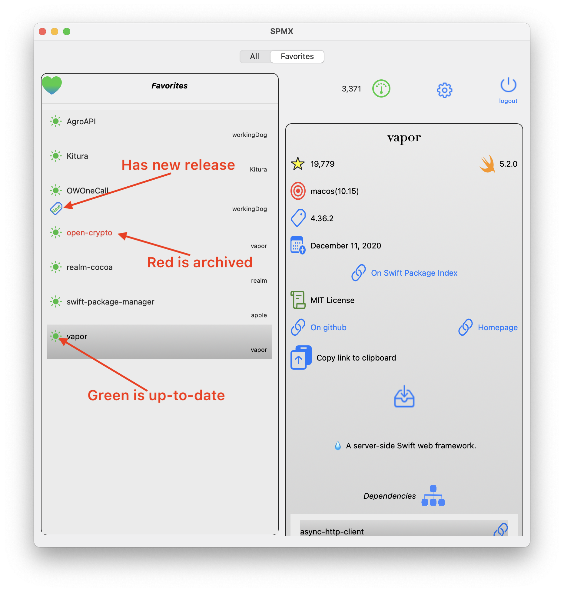

 

Home page is at [SPMX home](https://workingdog.github.io/SPMExplorer/)

 

**SPMX** lists Swift packages that reside on GitHub. 
It allows software developers to easily find and explore Swift packages for use in their iOS and macOs Apps. 

The **SPMX** App relies on the list of Swift packages from 
[Swift Package Index](https://swiftpackageindex.com/). It is in essence an interface to this list.

To use **SPMX** you need a [GitHub account](https://github.com/). In your account you also need to setup a [Personal Access Token](https://docs.github.com/en/github/authenticating-to-github/creating-a-personal-access-token). Use this token to login to **SPMX**.

**SPMX** requires ios 14 or macos 11.

 
