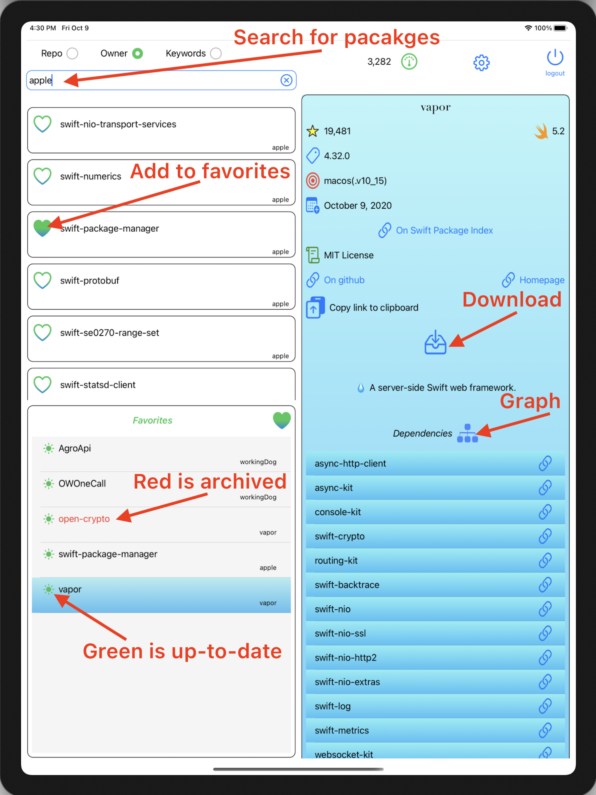

**SPMX** lists Swift packages that reside on GitHub. 
It allows software developers to easily find and explore Swift packages for use in their iOS and macOs Apps. 

The **SPMX** App relies on the list of Swift packages from 
[Swift Package Index](https://swiftpackageindex.com/). It is in essence an interface to this list.

#### For iPad

The **SPMX** App for iPad is **free** and is available on the [Apple Store](https://workingdog.github.io/SPMExplorer/).

#### For Mac

The **SPMX** App is also available for Mac, it is also **free** and is available on the Mac [Apple Store](https://workingdog.github.io/SPMExplorer/).

# SPMX support

Please address all correspondence regarding the **SPMX** Apps to: <catchi.assist@gmail.com>

# Privacy Policy
 
The following *Privacy Policy* applies to **SPMX** for iPad and Mac (the Apps).
 
##### Information Collection, Use, and Sharing
 
**SPMX** Apps do not:
 
 * collect, access or record any personal information,
 * collect, access or record any location information,
 * collect, access or record any other information,
 * contain any In-App purchase,
 * display any advertising,
 * ask for credit card number or any payment, it is free, 
 * ask for any personal information,
 * lock you into subscription.
   
 We only have access to information that you voluntarily give us via email 
 or other direct contact from you. We will not sell or rent this information to anyone.
 
 We will use your information to respond to you, regarding the reason you contacted us. 
 We will not share your information with any third party outside of our organization, 
 other than as necessary to fulfill your request.
 
 Unless you ask us not to, we may contact you via email in the future to answer your 
 questions regarding the **Apps** 
 or changes to this privacy policy.
 
##### Your Access to and Control Over Information 
 
You may opt out of any future contacts from us at any time. 
 
If you feel that we are not abiding by this privacy policy, you should contact us 
immediately via email <catchi.assist@gmail.com>.
 